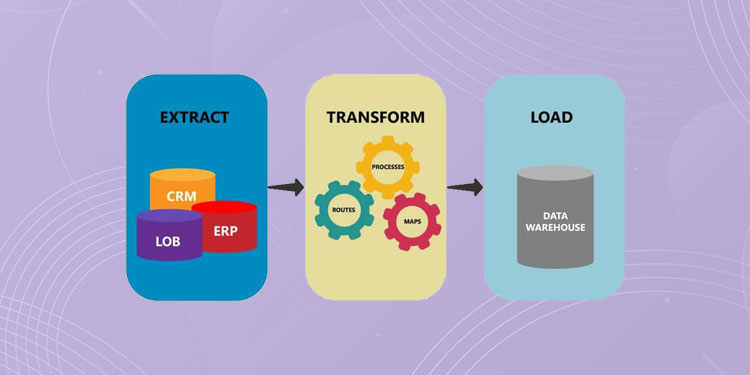

# Remote Work and Travel 
## Extract-Transform-Load

## Overview 

Day to day life was severely interrupted almost two years ago due to the impact of COVID-19. Including in person work environments. 

This project will focus on data related to remote work and travel, specifically in the years post COVID-19. Remote work, work from office, and travel data were transformed and loaded to determine connections and trends in the data that has been provided. 

## Analysis 

Jupyter notebook as well as pandas and postgreSQL were used in this analysis to answer the following questions: 

1. What age groups were surveyed to collect this data and what conclusions can we draw from the different age groups based on their responses
 

2. What type of occupations were surveyed for this data and were there any uncovered trends based on this factor?
 
3. How did travel have an effect on the United States and can a relationship between travel and remote work be determined?

### ETL 

<strong>EXTRACT</strong>

The following sources were utlized to extract data:

Kaggle-Remote Working Survey-https://www.kaggle.com/datasets/melodyyiphoiching/remote-working-survey 

Kaggle-Predict if people prefer WFH vs WFO post Covid-19-https://www.kaggle.com/datasets/anninasimon/predict-if-people-prefer-wfh-verses-wfo-data?
resource=download&select=WFH_WFO_dataset.csv  

Bureau of Transportation Statistics- https://www.bts.gov/covid-19

The data was formatted in csv files. 

<strong>TRANSFORM</strong>

The data sources were transformed into dataframes that were cleaned to only show the most important data within the datasets. The 'Remote Working Survey' and 'Predict if people prefer WFH vs WFO post COVID-19' datasets were joined to allow ease of visualization. 

The Bureau of Transportation and Statistics dataset was joined with the WFH vs. WFO dataset. This allows the user to visualize multiple variables from two different aspects of data to draw conclusions on the impact of travel pre and post COVID-19.   

<strong>LOAD</strong>

The transformed data was loaded into PostgreSQL, a relational database. This topic was chosen to determine useful and relevant trends in data related to remote office work. 
 
The data was loaded into six different tables in PostgreSQL:
 
1. Travel-number of trips and distance traveled
2. WFH vs. WFO-number of people working at home and not at home post COVID-19
3. Preferences for working at home
4. rws_comb- Variables related to remote work in the years of 2020 and 2021

This data can be utlized to assist employers in determining wether the remote work culture is beneficial for their employees and work environment. 

## Conclusion 

1. Between the data collected, the age of workers that were surveryed were between early-20s and mid-60s. From the data collected, the user can determine if age effects factors related to remote work such as; stress level, saving money, work-life-balance, productivity, etc.
 

2. Engineers, tutors, business owners, administrators, and many more were surveyed for the data. These groups were also broken into managerial or non-managerial columns within one of the data sets. Based on this wide range of information, it can be useful for the user to determine if there could be trends related to specific industries and wether or not management has a strong effect on remote work. 
 

3. The effects of travel in the United States was greatly impacted by the increase in remote work. The data provided breaks down the number of people staying at home vs. not staying at home by month. The user can look at these trends and correlate the timeline to real world events as well as the two sets of data to determine if remote work had a strong effect on travel.

